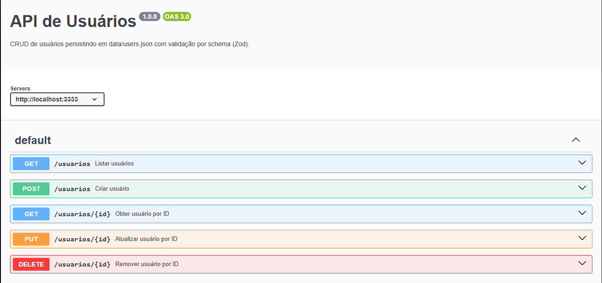

# API de Usuários

API para gerenciamento de usuários, desenvolvida em **Node.js**.

---

## 🚀 Como Executar

1. Clone o repositório:

```bash
git clone https://github.com/vagnercruz/api-usuarios.git
cd api-usuarios
```

2. Instale as dependências:

```bash
npm install
```

3. Inicie a API localmente:

```bash
npm run dev
```

A API estará disponível em **`http://localhost:3333`**.

---

## 🧪 Exemplos de Uso com `curl`

### Criar um usuário

```bash
curl -X POST http://localhost:3333/docs \
  -H "Content-Type: application/json" \
  -d '{
    "nome": "João",
    "sobrenome": "Silva",
    "idade": 30,
    "profissao": "Desenvolvedor",
    "cidade": "Pato Branco",
    "estado": "PR"
  }'
```

### Listar todos os usuários

```bash
curl http://localhost:3333/docs
```

### Buscar usuário por ID

```bash
curl http://localhost:3333/docs/{id}
```

---

## 📑 Documentação Swagger

A documentação da API está disponível em:

* **[http://localhost:3333/docs](http://localhost:3333/docs)**
* ou **[http://localhost:3333/api-docs](http://localhost:3333/api-docs)**

---

## 🧬 Modelo (Schema) do Usuário

Campos aceitos no payload da requisição:

* `id`: UUID (gerado automaticamente no `POST`, não pode ser alterado)
* `nome`: string (mínimo 2 caracteres)
* `sobrenome`: string (mínimo 2 caracteres)
* `idade`: número inteiro entre 0 e 120
* `profissao`: string (mínimo 2 caracteres)
* `cidade`: string (mínimo 2 caracteres)
* `estado`: sigla do estado brasileiro (ex: SP, RJ, AC, AL, etc.)

---

## 🛠️ Códigos de Status

* `201`: Criado com sucesso
* `204`: Operação concluída sem conteúdo
* `400`: Requisição inválida (erros de validação)
* `404`: Recurso não encontrado

---

## 📸 Swagger UI


